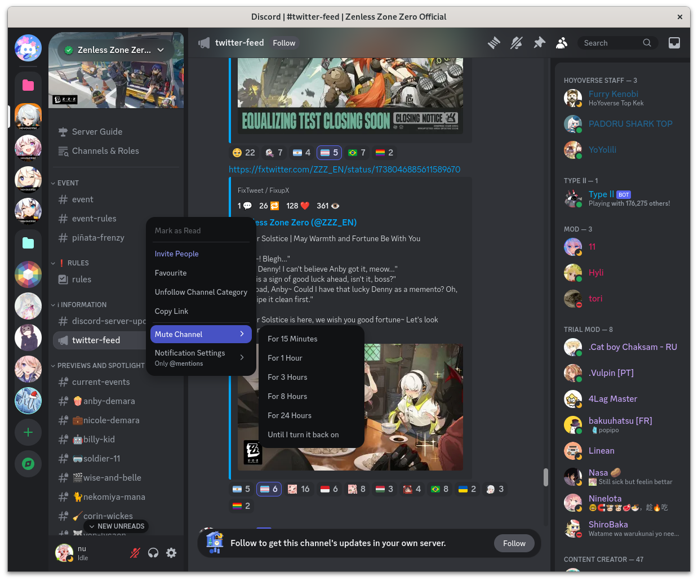

<div align="center">

# Amenity
Modernising Discord with theming.



</div>

## How to use?

Use a client like Vencord and paste this link into your themes field;

```
https://nvkomata.github.io/amenity/amenity.css
```

Or click below to install in browser with the Stylus extension;

[](https://nvkomata.github.io/amenity/amenity.user.css)

## Contributing
Found a bug? Have a suggestion?

Make an [issue](https://github.com/nvkomata/amenity/issues) or [fork and PR](https://github.com/nvkomata/amenity/pulls)!
